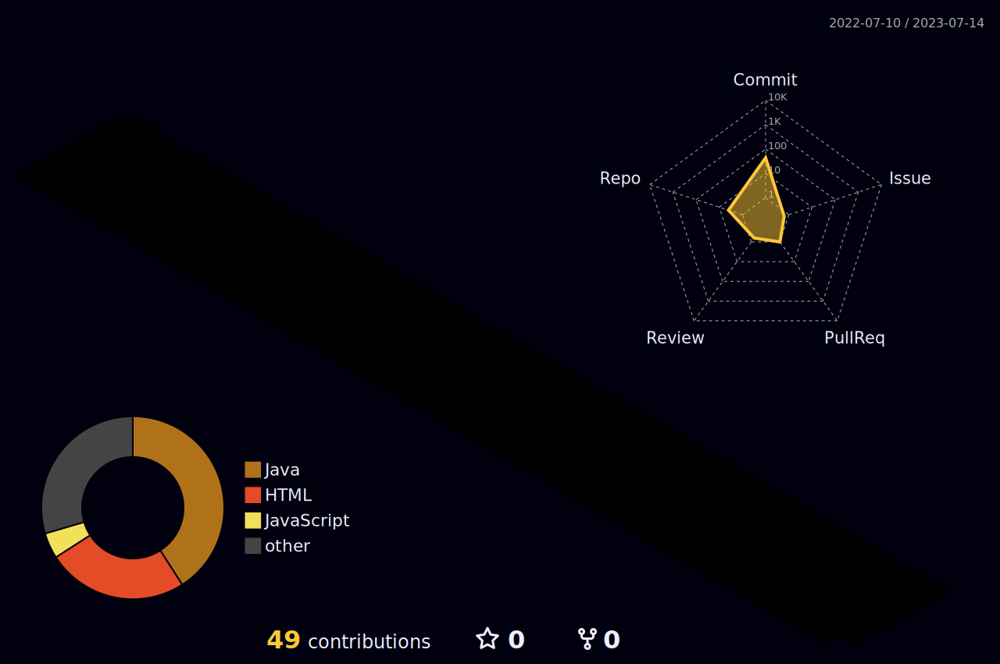

### Hi there 👋

<!-- **flankx/flankx** is a ✨ _special_ ✨ repository because its `README.md` (this file) appears on your GitHub profile.

Here are some ideas to get you started: -->

- 🔭 I’m currently working on ...
- 🌱 I’m currently learning ...
- 👯 I’m looking to collaborate on ...
- 🤔 I’m looking for help with ...
- 💬 Ask me about ...
- 📫 How to reach me: ...
- 😄 Pronouns: ...
- ⚡ Fun fact: ...


<!-- github stats & top langs[&layout=compact 紧凑布局]-->


<!-- github打卡 -->
<!--  -->


<!--START_SECTION:waka-->

```text
Other   1 hr 29 mins    ██████████████████▓░░░░░░   74.93 %
```

<!--END_SECTION:waka-->

